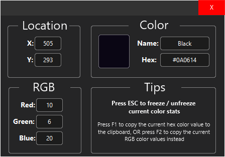

    <h1 align="center">Color Detector</h1>
    

        Color Detector with JavaFX
    

    

        <a href="https://github.com/Don-Cryptus/ColorDetector/releases/latest">Try it out</a>
        ·
        <a href="https://github.com/Don-Cryptus/ColorDetector/issues">Report Bug</a>
        ·
        <a href="https://github.com/Don-Cryptus/ColorDetector/issues">Request Feature</a>
         
    

    

    
    

